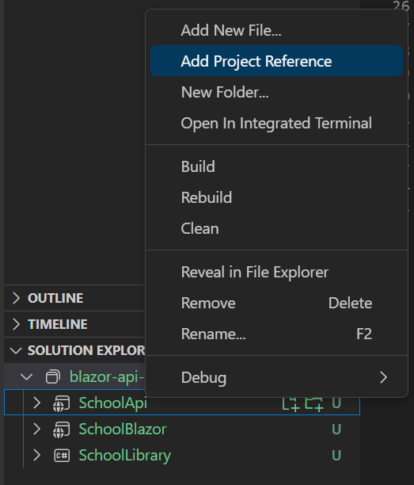

## Getting Started

### App Building Steps

1.  **Make a new folder to store your application**:

    ```bash
     mkdir blazor-api-sqlite
    ```

2.  **Create the respective apps for the ClassLibrary, API, and Blazor app**:

    ```bash
    dotnet new classlib -o SchoolLibrary

    dotnet new webapi -o SchoolApi

    dotnet new blazorwasm -o SchoolBlazor
    ```

3.  **Create a solution file in the root of the project and add the Apps to the solution**:

    ```bash
    dotnet new sln


    dotnet sln add SchoolApi/SchoolApi.csproj

    dotnet sln add SchoolBlazor/SchoolBlazor.csproj

    dotnet sln add SchoolLibrary/SchoolLibrary.csproj
    ```

4.  **Build the app to make sure everything got added/created correctly**:

    ```bash
     dotnet build
    ```

5.  **Open the project in VSC and open the solution explorer**:

    
    <br />
    <br />
    right click on the Api and Blazor apps and add a reference to the ClassLibrary

6.  **Open the SchoolLibrary folder in VS Code. Delete Class1.cs, then create a new Student.cs class file and add to it the following code**:

    ```cs
    public class Student
    {
        public string? StudentId { get; set; }
        [Required]
        public string? FirstName { get; set; }
        [Required]
        public string? LastName { get; set; }
        [Required]
        public string? School { get; set; }
    }
    ```

7.  **Inside the root of the API app install the following packages**:

    ```bash
    dotnet add package Microsoft.AspNetCore.Diagnostics.EntityFrameworkCore
    dotnet add package Microsoft.AspNetCore.Identity.EntityFrameworkCore
    dotnet add package Microsoft.EntityFrameworkCore.Sqlite
    dotnet add package Microsoft.EntityFrameworkCore.Design
    dotnet add package Microsoft.EntityFrameworkCore.SqlServer
    dotnet add package Microsoft.EntityFrameworkCore.Tools
    dotnet add package Microsoft.VisualStudio.Web.CodeGeneration.Design
    ```

    NOTE: The SqlServer package above is only used for code generation.

8.  **Now we need to add a connection string to the database, inside the API app in appsettings.Development.json add the following string**:

    ```json
    "ConnectionStrings": {
        "DefaultConnection": "DataSource=college.db;Cache=Shared"
    }
    ```

9.  **We will be using the Entity Framework Code First approach. The starting point is to create a database context class. Create a folder named Data in the API project, then add a C# class file named SchoolDbContext.cs in the new Data folder with the following class code**:

    ```cs
    public class SchoolDbContext : DbContext
    {
        public DbSet<Student> Students { get; set; }

        public SchoolDbContext(DbContextOptions<SchoolDbContext> options) : base(options) { }

        protected override void OnModelCreating(ModelBuilder builder)
        {
            base.OnModelCreating(builder);
            builder.Entity<Student>().HasData(
            new
            {
                StudentId = Guid.NewGuid().ToString(),
                FirstName = "Tom",
                LastName = "Day",
                School = "Physics"
            }, new
            {
                StudentId = Guid.NewGuid().ToString(),
                FirstName = "Ann",
                LastName = "Fox",
                School = "Geology"
            }, new
            {
                StudentId = Guid.NewGuid().ToString(),
                FirstName = "Art",
                LastName = "Ash",
                School = "Nursing"
            }, new
            {
                StudentId = Guid.NewGuid().ToString(),
                FirstName = "Mia",
                LastName = "Hay",
                School = "Science"
            }
            );
        }
    }
    ```

10. **In the Program.cs file in the SchoolAPI project, add the following code above var app = builder.Build(); so that our application can use SQLite**:

    ```cs
    var connectionString =
    builder.Configuration.GetConnectionString("DefaultConnection");
    builder.Services.AddDbContext<SchoolDbContext>(options =>
    options.UseSqlite(connectionString));


    var app = builder.Build(); // ================================== Everything above is a service that we add, everything below is a service that we use
    ```

11. **We are now ready to apply Entity Framework migrations, create the database and seed data. Remember to build your entire solution before proceeding. Then, from within a terminal window in the SchoolAPI directory, run the following command to create migrations**:

    ```bash
    dotnet ef migrations add M1 -o Data/Migrations
    ```

12. **The next step is to create the SchoolDB database in SQLite. This is done by running the following command from inside a terminal window at the SchoolAPI folder**:

    ```bash
    dotnet ef database update
    ```

13. **If no errors are encountered, we can assume that the database was created and properly seeded with data. Let us create an API controller so that we can see the data that is in our database**:

    ```bash
    dotnet aspnet-codegenerator controller -name StudentsController -async -api -m Student -dc SchoolDbContext -outDir Controllers
    ```

14. **Now you can run the application by the following in a terminal window inside the API project**:

    ```bash
    dotnet watch
    ```

15. **Now you can run the application by the following in a terminal window inside the API project**:

    ```bash
    dotnet watch
    ```

16. **Point your browser to https://localhost:XXXX/api/students and you will see the following**:

    ```json
    [
        {
            "studentId": "38e539e5-359d-435d-8661-760a0e897cc5",
            "firstName": "Tom",
            "lastName": "Day",
            "school": "Physics"
        },
        {
            "studentId": "9f603214-6bfc-482d-86e1-6665e5d8a4b2",
            "firstName": "Art",
            "lastName": "Ash",
            "school": "Nursing"
        },
        {
            "studentId": "aafd60ec-0364-4c82-b5a2-8a0e617faeef",
            "firstName": "Mia",
            "lastName": "Hay",
            "school": "Science"
        },
        {
            "studentId": "c589163b-ca78-4f62-8873-110d9e0d0fe6",
            "firstName": "Ann",
            "lastName": "Fox",
            "school": "Geology"
        }
    ]
    ```

17. **Even though our API app seems to be working fine, there is one more thing we need to do. We need to enable CORS (Cross Origin Resource Sharing) so that the service can be accessed from other domains. Add the following code to the Program.cs file before “var app = builder.Build();”**:

    ```cs
    // Add Cors
    builder.Services.AddCors(o => o.AddPolicy("Policy", builder =>
    {
        builder.AllowAnyOrigin()
        .AllowAnyMethod()
        .AllowAnyHeader();
    }));
    ```

18. **Add this statement in the Configure() method also in Program.cs just before “app.MapControllers();”**:

    ```cs
    // add CORS
    app.UseCors("Policy");
    ```

19. **Add the following annotation to the StudentsController.cs class**:

    ```cs
    [EnableCors("Policy")]
    ```

20. **We will add a Students razor page and menu item to this client-side Blazor application. Open the \_Imports.razor file in the editor and add the following using statement to the bottom of the content so that the Student class is available to all views**:

    ```cs
    @using SchoolLibrary
    ```

21. **Make a duplicate copy of the Pages/FetchData.razor file and call the new file GetAllStudents.razor. Replace its contents with the following code**:

    ```cs
    @page "/students"
    @inject HttpClient Http

    <PageTitle>Students</PageTitle>

    <h1>Students</h1>

    @if (students == null)
    {
        <p><em>Loading...</em></p>
    }
    else
    {
        <table class="table">
            <thead>
                <tr>
                    <th>ID</th>
                    <th>Name</th>
                    <th>School</th>
                    <th></th>
                    <th></th>
                </tr>
            </thead>
            <tbody>
                @foreach (var student in students)
                {
                    <tr>
                        <td>@student.StudentId</td>
                        <td>@student.FirstName @student.LastName</td>
                        <td>@student.School</td>
                        <td><a class="btn btn-success btn-sm" href="/updel/@student.StudentId/edit">Edit</a></td>
                        <td><a class="btn btn-danger btn-sm" href="/updel/@student.StudentId/del">Delete</a></td>
                    </tr>
                }
            </tbody>
        </table>
    }

    @code {
        private Student[]? students;

        protected override async Task OnInitializedAsync()
        {
            students = await Http.GetFromJsonAsync<Student[]>($"{Constants.BASE_URL}api/students");
        }
    }
    ```

22. **Make sure you adjust the value of baseUrl to match the URL of your SchoolAPI service. The URL of the API service will be used in multiple pages Therefore, it should be placed soewhere where it can be shared. Create a class named Constants.cs in the root folder with the following code**:

    ```cs
    public class Constants
    {
        public static string BASE_URL = "http://localhost:XXXX/";
    }
    ```

23. **Let us add a menu item to the left-side navigation of our client application. Open Shared/NavMenu.razor in the editor and add the following**:

    ```cs
    <div class="nav-item px-3">
        <NavLink class="nav-link" href="add">
            <span class="oi oi-plus" aria-hidden="true"></span> Add Student
        </NavLink>
    </div>
    <div class="nav-item px-3">
        <NavLink class="nav-link" href="students">
            <span class="oi oi-list-rich" aria-hidden="true"></span> List Students
        </NavLink>
    </div>
    ```

24. **Create a new razor page named AddStudent.razor with the following code**:

    ```cs
    @page "/add"
    @inject HttpClient httpClient
    @inject NavigationManager NavManager

    <PageTitle>Add Student</PageTitle>

    <h1>Add Student</h1>

    <EditForm Model="@student" OnValidSubmit="@HandleAdd">
        <DataAnnotationsValidator />
        <ValidationSummary />
        <InputText placeholder="First Name" id="firstName" @bind-Value="@student.FirstName" />
        <br />
        <InputText placeholder="Last Name" id="lastName" @bind-Value="@student.LastName" />
        <br />
        <InputText placeholder="School" id="school" @bind-Value="@student.School" />
        <br />
        <button type="submit">Submit</button>
    </EditForm>

    @code {
        private Student student = new Student();

        private async void HandleAdd()
        {
            string endpoint = $"{Constants.BASE_URL}api/students";

            student.StudentId = Guid.NewGuid().ToString();

            await httpClient.PostAsJsonAsync(endpoint, student);

            // redirect to the students page
            NavManager.NavigateTo("/students");
        }
    }
    ```

25. **Create a named UpdateDelete.razor with the following content**:

    ```cs
    @page "/updel/{id}/{mode}"
    @inject HttpClient httpClient
    @inject NavigationManager NavManager

    <p>Student with ID == @Id</p>

    @if (student != null && Mode == "edit") // Update
    {
        <h1>UPDATE</h1>

        <EditForm Model="@student" OnValidSubmit="@HandleUpdate">
            <DataAnnotationsValidator />
            <ValidationSummary />
            <InputText placeholder="First Name" id="firstName" @bind-Value="@student!.FirstName" />
            <br />
            <InputText placeholder="Last Name" id="lastName" @bind-Value="@student.LastName" />
            <br />
            <InputText placeholder="School" id="school" @bind-Value="@student.School" />
            <br />
            <button type="submit" class="btn btn-success">Submit</button>
            @code
            {
            private async void HandleUpdate()
            {
            string endpoint = $"{Constants.BASE_URL}api/students/{student!.StudentId}";
            await httpClient.PutAsJsonAsync(endpoint, student);
            NavManager.NavigateTo("/students");
            }
        }
    </EditForm>
    }
    @if (student != null && Mode == "del") // Delete form
    {
        <h1>Delete</h1>
        <EditForm Model="@student" OnValidSubmit="@HandleDelete">
            <DataAnnotationsValidator />
            <ValidationSummary />
            <InputText placeholder="First Name" id="firstName" @bind-Value="@student.FirstName" />
            <br />
            <InputText placeholder="Last Name" id="lastName" @bind-Value="@student.LastName" />
            <br />
            <InputText placeholder="School" id="school" @bind-Value="@student.School" />
            <br />
            <button type="submit" value="Delete" class="btn btn-danger">Submit</button>
            @code
            {
            protected async void HandleDelete()
            {
            string endpoint = $"{Constants.BASE_URL}api/students/{student!.StudentId}";
            await httpClient.DeleteAsync(endpoint);
            NavManager.NavigateTo("/students");
            }
        }
    </EditForm>
    }
    @code
    {
        [Parameter]
        public string? Id { get; set; }
        [Parameter]
        public string? Mode { get; set; }
        Student? student;
        protected override async Task OnInitializedAsync()
        {
            var url = $"{Constants.BASE_URL}api/students/{Id}";
            student = await httpClient.GetFromJsonAsync<Student>(url);
        }
    }
    ```

    
